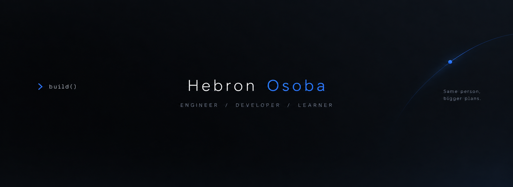

<p align="center">
  
</p>

<p align="center">
  <a href="https://github.com/ProfHebbie">
    
  </a>
  <a href="www.linkedin.com/in/hebron-osoba-367534363">
    
  </a>
</p>

<p align="center">
  

  
</p>

## 👋 About Me

I'm a Mechatronics Engineering student who likes building things and figuring out how they work.

⚙️ Mechatronics & electronics  
🐍 Python & software projects  
🤖 AI / Machine Learning  
🌐 Web development  
🧠 Currently learning, experimenting, and building

> Build. Learn. Improve.  
> 0.1% better every day.

## 🛠️ Tech Stack

<p align="center">


</p>

## 🧠

```python
while Curiosity == True:
    build_something()
```
## Featured Projects

### [Name-Forge](https://github.com/ProfHebbie/Name-Forge)

> Give an idea a name worth keeping.

A lightweight naming assistant that takes a website brief, extracts its direction, generates naming ideas, and checks for potential conflicts across domains and web results.

<p>


</p>

<a href="https://github.com/ProfHebbie/Name-Forge">
  
</a>

---

### [Mood-tracker](https://github.com/ProfHebbie/Mood-tracker)

> A small place to keep track of how you're feeling.

A simple desktop mood journal where you can log a mood, add a note, switch themes, and look back through saved entries.

<p>

</p>

<a href="https://github.com/ProfHebbie/Mood-tracker">
  
</a>

## Currently Learning

- Machine Learning with Python
- Computer Vision with OpenCV
- Embedded systems & microcontrollers
- Better software engineering practices

## Beyond Code

When I'm not coding, I'm probably gaming, watching anime, studying, working on some random project, or getting distracted by something I suddenly want to learn.

---

<p align="center">
  Built with curiosity.
</p>


